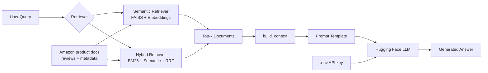

# Amazon Product Query Assistant

This project explores how to build a smart Amazon product query assistant using multiple information retrieval and generation methods. It compares BM25 keyword retrieval, semantic search with embeddings, and a Hybrid RAG pipeline on the [Amazon Reviews 2023](https://amazon-reviews-2023.github.io/) dataset. The system supports both retrieval-only search and retrieval-augmented generation (RAG), and presents the results through an interactive [Streamlit](https://streamlit.io/) app where users can explore product results or receive LLM-generated answers based on retrieved Amazon product metadata and reviews.

The web interface can now be accessed at <https://yhouyang02-dsci-575-project-yuhengo-mkcchoy.share.connect.posit.cloud>.

## Project maintainers

- [Mickey Choy](https://github.com/Maple018)
- [Yuheng Ouyang](https://github.com/yhouyang02)

## Repository structure

```
DSCI_575_project_yuhengo_mkcchoy
  ├── app/                     # Streamlit app code
  ├── bm25_index/              # BM25 retriever artifacts
  ├── data/                    # Raw and processed data (downloaded separately)
  ├── notebooks/               # Jupyter notebooks for experimentation
  ├── results/                 # Result discussion and analysis
  ├── semantic_index/          # Semantic retriever artifacts
  ├── src/                     # Source code for data processing and retrieval
  ├── environment.yml          # Conda environment specification
  ├── README.md                # Project overview and instructions
```

## Get started

To run the app locally, follow the following steps:

1. Clone the repository and navigate to the project directory.

    ```bash
    git clone https://github.com/UBC-MDS/DSCI_575_project_yuhengo_mkcchoy.git
    cd DSCI_575_project_yuhengo_mkcchoy
    ```

2. Create and activate the  conda` environment.

    ```bash
    conda env create -f environment.yml
    conda activate dsci-575-mkc-yho
    ```

3. To use the RAG mode, create a Hugging Face Access Token following their [instruction](https://huggingface.co/docs/hub/en/security-tokens). When creating a new token,
   - Choose "Fine-grained" for token type
   - Check all permissions under "Repositories" and "Inference"

4. Add the API token into your local folder. This should not be committed to any remote repositories. Replace `<your-api-token>` with the token value you just created and run the following in your terminal. You must have this ready to use the LLM-powered RAG mode.

   ```bash
   echo "HUGGINGFACEHUB_API_TOKEN=<your-api-token>" > .env
   ```

5. Start the Streamlit app. The app should open in your default web browser at `http://localhost:8501`. If it does not open automatically, you can navigate to that URL manually. It can take a few minutes to load the full app.

    ```bash
    streamlit run app/app.py
    ```

6. Enter product-related queries in the input box and click the "Search" button. The results may be limited since our test models are built on a subset of the full dataset. For better results, you can try queries related to the "Appliances" category, such as "quiet dishwasher stainless steel".

7. To stop the app, press `Ctrl+C` in the terminal where the Streamlit app is running.

8. For developers who want to retrain the models with a different sample size or adjust the training process, you can modify `src/build_artifacts.py` and run the following command to rebuild the model artifacts. This will retrain the BM25 and semantic retrievers and save the new artifacts in their respective folders.

    ```bash
    python src/build_artifacts.py
    ```

## RAG workflow diagram


